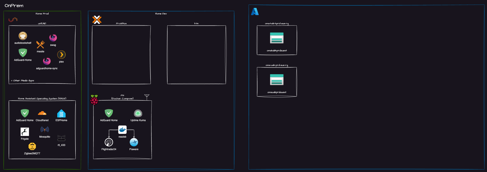

# Homelab 2025

Welcome to my Homelab 2025 project! This is a Monorepo for my homelab project. The goal of this project is to provide a single source of truth for all the services and infrastructure that make up my homelab.

Its very much a work in progress and i am constantly adding new services and infrastructure to it. The goal is to have a single place to document everything that is going on in my homelab.

Sometimes i'll do deep dives into specific services over on my blog [https://thecomalley.github.io](https://thecomalley.github.io/) but for the most part this is a place to document everything that is going on in my homelab.

# Platforms
- [Azure](./platforms/azure/README.md) 
- [Proxmox](./platforms/proxmox/README.md)
- [unRAID](./platforms/unraid/README.md)
- k3s (Future Plans)

# Workloads
- [azure-pipeline-agents](./workloads/azure-pipeline-agents/README.md) - Self Hosted Azure DevOps Pipeline Agents running on Proxmox & in the ALZ
- [Home-assistant](./workloads/home-assistant/README.md) - Azure components for Home Assistant
- [rpi3b](./workloads/rpi3b/README.md) - A simple Docker stack that runs some ADS-B services on a Raspberry Pi 3B+
- [swag](./workloads/swag/README.md) - Secure Web Access Gateway (SWAG) running on unRAID
- [unraid-appdata-backup](./workloads/unraid-appdata-backup/README.md) - Backup unRAID appdata to Azure Blob Storage
- [windows-server-lab](./workloads/windows-server-lab/README.md) - A Windows Server Lab running on Proxmox
---

### Clouds

The HomeLab isn't just at home, it also spans Azure (Since this is what i work with during my day job). The goal is to have a single source of truth for all the services and infrastructure that make up my homelab.

### Environments

As is often the case with Homelab environments i have a family that consumes *some* of the services the Homelab provides. As such we can refer to the following environments:

- **Home Production (prd)** This is any service anyone other than me uses. This includes things like the Plex, DNS etc.
- **Home Development (dev)** This is stuff only I care about and carries a slightly more relaxed SLA :P

---

## Secret Scanning via `detect-secrets`

1. `detect-secrets scan > .secrets.baseline` to identify secrets in the codebase.
2. `detect-secrets audit .secrets.baseline scan` to review and exclude false positives.